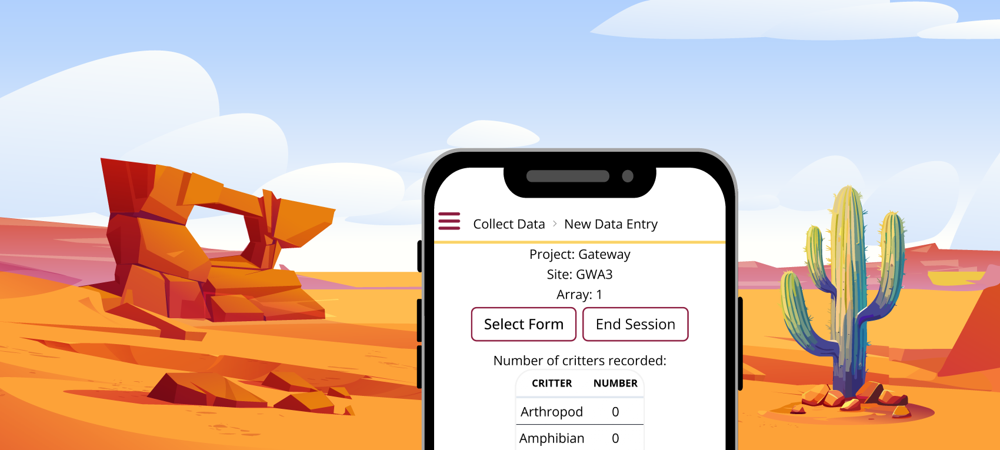
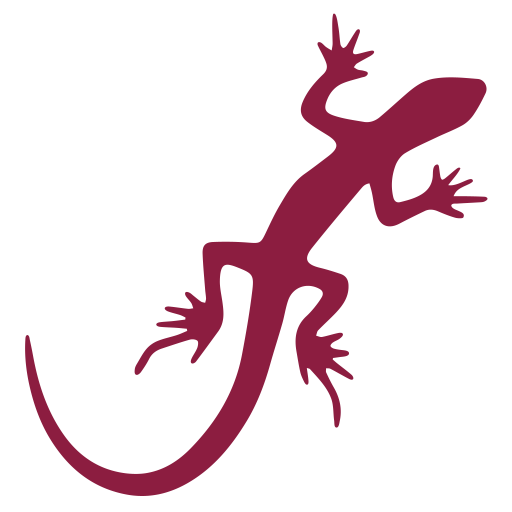
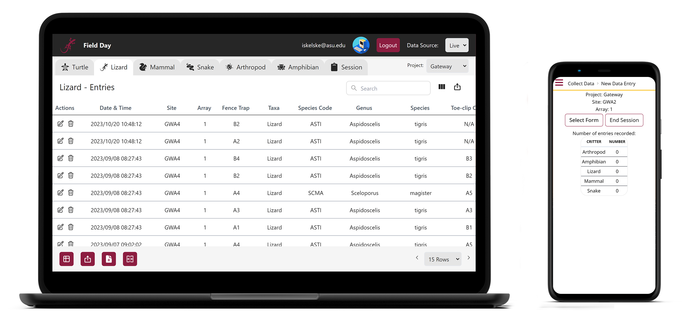

  
  <h1>Field Day</h1>
  
<strong>Practical data collection and management tools for wildlife researchers.</strong>

  

    <a href="https://asu-field-day-pwa.web.app/">Try the Mobile Data Collector</a>
    &middot;
    <a href="https://asu-field-day-webui.web.app/">Open the Desktop Data Manager</a>
    &middot;
    <a href="https://github.com/Field-Day-2022/.github/blob/main/CONTRIBUTING.md">Contribute</a>
  

## About Field Day

Field Day is an open-source toolkit for collecting and managing wildlife research data. It supports capture-mark-recapture studies and other field workflows through two connected applications: an offline-capable mobile data collector and a desktop-friendly data manager.

## Applications

### [Mobile Data Collector (MDC)](https://github.com/Field-Day-2022/mobile-data-collector)

A mobile-first React application designed for researchers working in remote locations.

- Collect observations while offline and sync them when connectivity returns.
- Use structured forms and predefined answer sets for consistent data entry.
- Securely access projects with Google authentication.

**[Launch the MDC](https://asu-field-day-pwa.web.app/)** &middot; **[View repository](https://github.com/Field-Day-2022/mobile-data-collector)**

### [Desktop Data Manager (DDM)](https://github.com/Field-Day-2022/desktop-data-manager)

A responsive web application for reviewing, managing, and exporting data collected with the MDC.

- Browse, sort, and edit observations in a streamlined table.
- Export research data to CSV.
- Create and update answer sets for structured field forms.

**[Launch the DDM](https://asu-field-day-webui.web.app/)** &middot; **[View repository](https://github.com/Field-Day-2022/desktop-data-manager)**

## See Field Day in Action

## Technology

| Area | Technologies |
| --- | --- |
| Frontend | React, Vite, Tailwind CSS |
| Backend | Firebase, Cloud Firestore |
| Documentation | Asciidoctor |

## Acknowledgment

Field Day is sponsored by [Professor Heather Bateman](https://www.linkedin.com/in/heather-bateman-68341013/), Professor and Researcher of Biology.

## Get Involved

Contributions that make field research workflows more reliable, accessible, and efficient are welcome. Read the [Contribution Guide](https://github.com/Field-Day-2022/.github/blob/main/CONTRIBUTING.md) or explore the [Field Day repositories](https://github.com/orgs/Field-Day-2022/repositories) to get started.
