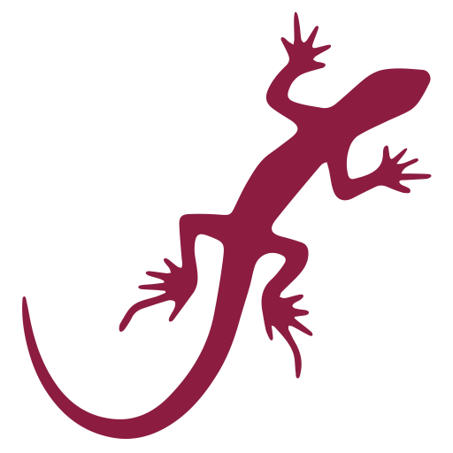

#  Welcome to Field Day Organization!

The **Field Day Project** is an innovative solution designed to support wildlife researchers in collecting and managing data efficiently. Our tools cater to the unique challenges faced by field researchers, particularly in biology and ecology.

## 🌟 Introduction

Field Day is built with modern web technologies and includes two key components:
- **[Field Day Mobile Data Collector (MDC)](https://github.com/Field-Day-2022/mobile-data-collector):** Optimized for mobile devices, this app facilitates offline data collection for wildlife population studies using capture-mark-recapture techniques.
- **[Field Day Desktop Data Manager (DDM)](https://github.com/Field-Day-2022/desktop-data-manager):** A desktop-friendly web application designed for managing and exporting collected data.

Both tools are secure, scalable, and cost-effective, leveraging Firebase for backend services and integrating dynamic features such as offline support, advanced authentication, and data export functionality.

## 🖥️ Field Day Applications

### 1. [**Field Day Mobile Data Collector**](https://github.com/Field-Day-2022/mobile-data-collector)
The **Field Day MDC** is a React-based mobile application tailored for researchers working in remote locations. Key features include:
- **Offline Mode**: Cache data locally for uninterrupted use in the field.
- **Custom Data Input Forms**: Capture and log observations with predefined answer sets.
- **Google Authentication**: Secure access with two-factor authentication.

🔗 **[Try the MDC](https://asu-field-day-pwa.web.app/)**

---

### 2. [**Field Day Desktop Data Manager**](https://github.com/Field-Day-2022/desktop-data-manager)
The **Field Day Desktop Data Manager (DDM)** is designed to view, manage, and export wildlife data collected using the Field Day MDC. Optimized for larger screens, it includes:
- **Dynamic Data Management**: View, sort, and edit data in a streamlined table view.
- **Data Export**: Easily export observations to CSV format.
- **Answer Set Management**: Define and modify templates for structured data input.
- **Responsive Design**: Optimized for laptops, desktops, and tablets.

🔗 **[Explore the DDM](https://asu-field-day-webui.web.app/)**

---

## 🛠️ Technology Stack

Field Day applications are built using modern web development tools to ensure performance, scalability, and ease of use:
| **Category**      | **Technologies**                                                                                                                                                                                                                                                                                                            |
| ----------------- | --------------------------------------------------------------------------------------------------------------------------------------------------------------------------------------------------------------------------------------------------------------------------------------------------------------------------- |
| **Frontend**      |    |
| **Backend**       |                                                                                                     |
| **Documentation** |                                                                                                                                                                                                         |

---

## 🤝 Contributors and Acknowledgments

Field Day is made possible through the hard work of interdisciplinary teams of software engineers and biologists.

### 2022 Capstone Team
- **Isaiah Lathem** ([ilathem](https://github.com/ilathem))
- **Jack Norman** ([jakBkwik](https://github.com/jakBkwik))
- **Dennis Grassl** ([realdgrassl](https://github.com/realdgrassl))
- **Ian Skelskey** ([ianskelskey](https://github.com/ianskelskey))
- **Zachary Jacobson** ([zacharyjacobson](https://github.com/zacharyjacobson))

### 2024 Capstone Team

- **Quinten Knowles** ([qknowles](https://github.com/qknowles))
- **Chase Molstad** ([cmolstad1218793914](https://github.com/cmolstad1218793914))
- **Evan Hagood** ([evanhagood](https://github.com/evanhagood))
- **Ayesha Arif** ([ayeshaArif6](https://github.com/ayeshaArif6))
- **Timothy Weaver** ([tlweave2](https://github.com/tlweave2))

### Sponsor
- **[Professor Heather Bateman](https://www.linkedin.com/in/heather-bateman-68341013/):** Professor and Researcher of Biology

We are grateful for the continued support and dedication of all contributors!

---

## 📢 Get Involved

Interested in contributing or learning more? Check out our [Contribution Guide](https://github.com/Field-Day-2022/.github/blob/main/CONTRIBUTING.md) or reach out to us for collaboration opportunities.

---

